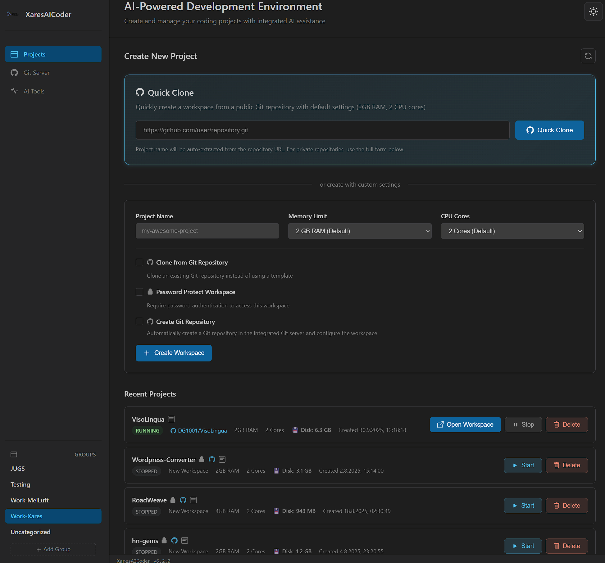

# XaresAICoder

[](https://deepwiki.com/DG1001/XaresAICoder)

A professional browser-based AI-powered development environment that integrates VS Code (code-server) with multiple AI coding assistants for enhanced productivity.




## Overview

https://github.com/user-attachments/assets/127a1253-5df2-4a5e-937d-a25840439ccd

XaresAICoder provides isolated development workspaces running VS Code in the browser, with integrated AI coding tools for comprehensive development assistance. Each workspace runs in a separate Docker container with resource limits, automatic cleanup, and seamless subdomain-based port forwarding.

## ✨ Key Features

### 🎯 **Professional Development Environment**
- **VS Code in Browser** with light theme inspired design
- **Isolated Docker Workspaces** with automatic resource management
- **Configurable Memory Allocation** - Choose 1GB, 2GB, 4GB, 8GB, or 16GB RAM per workspace
- **CPU Cores Selection** - Allocate 1-8 CPU cores per workspace
- **Resource Limits** - Configurable concurrent workspace limits and per-workspace resource caps
- **GPU Acceleration Support** - Automatic GPU passthrough for ML/AI workloads
- **Dual Proxy Modes** - Per-workspace **LLM Logging Proxy** (mitmproxy, records all traffic and captures AI conversations) or **Security Proxy** (Squid, whitelist-only access control)
- **Subdomain Port Forwarding** (e.g., `projectid-5000.localhost`)
- **Real-time Container Management** with start/stop controls
- **Optional Password Protection** for workspace security

### 🤖 **AI Development Tools**
Pre-configured workspace with multiple AI coding assistants:
- **Continue** - VS Code extension for AI-powered code completion and chat
- **Cline (Claude Dev)** - AI coding assistant with file editing capabilities
- **OpenCode SST** - Multi-model AI assistant for project analysis
- **Aider** - AI pair programming with direct file editing and git integration
- **Gemini CLI** - Google's AI for code generation and debugging
- **Claude Code** - Anthropic's agentic tool for deep codebase understanding
- **Qwen Code** - AI workflow automation and code exploration
- **OpenAI Codex CLI** - OpenAI's terminal-based coding assistant
- **Crush** - Multi-model AI with in-session model switching and LSP integration

### 🔧 **Development Ready**
- **Empty Project** or **Git Clone** - Start fresh or clone any HTTP/HTTPS Git repository directly into workspaces
- **Private Repository Support** - Secure authentication with username and access tokens
- **Persistent Git Credentials** - Seamless push/pull operations after cloning
- **Integrated Git Server** (optional) - Self-hosted Forgejo with GitHub Actions compatibility
- **Automatic Git Repository Creation** - One-click Git repo setup with workspace configuration
- **GitHub Integration** - Pre-installed GitHub CLI for seamless workflow

### 📁 **Project Organization**
- **Smart Project Grouping** - Organize projects into custom groups (Work, Personal, Learning, etc.)
- **Drag & Drop Interface** - Intuitive file manager-style organization with visual feedback
- **Sidebar Group Management** - Create, rename, and delete groups directly from the navigation sidebar
- **Instant Filtering** - Click any group to filter projects, click again to show all
- **Group Badges** - Visual project group indicators with one-click filtering
- **Automatic Organization** - Projects default to "Uncategorized" and can be moved anytime

## 🆕 Recent Updates

### Workshop Support (Latest)
- ✅ **Workspace Cloning** - Clone a base workspace into N identical copies for workshops
- ✅ **Workshop Landing Page** - Participant self-registration with automatic workspace assignment
- ✅ **Admin Overview** - Manage claims, release workspaces, export CSV
- ✅ **Per-Clone Git Branches** - Each clone gets its own branch in the shared Forgejo repo

### Dual Proxy Modes
- ✅ **LLM Logging Proxy** - mitmproxy records all traffic and captures AI API conversations
- ✅ **Security Proxy** - Squid whitelist-only filtering for assessments
- ✅ **Domain Recording & Whitelist Generation** - Teacher records domains, applies as student whitelist
- ✅ **LLM Conversation Export** - View, export, and generate documentation from captured conversations

### Password Management
- ✅ **Set/Update/Remove Passwords** - Full lifecycle via UI and API
- ✅ **Works on Running & Stopped Containers** - Seamless config updates

## 🚀 Quick Start

### Prerequisites

- **Docker** (with Docker Compose v1 or v2)
- **4GB+ RAM** available for containers  
- **Modern web browser** (Chrome/Chromium recommended)
- **Optional**: NVIDIA GPU with drivers for AI/ML acceleration

### One-Command Installation

```bash
# Clone and deploy in one go
git clone <repository-url>
cd XaresAICoder
./deploy.sh
```

**That's it!** The deploy script automatically:
- ✅ Detects Docker Compose version (v1 or v2)
- ✅ Sets up persistent Docker network  
- ✅ Builds custom VS Code image with AI tools
- ✅ Configures environment settings
- ✅ Deploys and health-checks the application

### Access Your Platform

After deployment completes, open your browser to:
- **Default**: http://localhost
- **Custom domain**: Your configured domain from the deploy script

### Create Your First Project

#### Empty Project
1. Enter a project name
2. Choose memory allocation (1GB, 2GB default, 4GB, 8GB, or 16GB RAM) and CPU cores (1-8)
3. **Optional**: Check "Password Protect Workspace" for secure access
4. **Optional**: Check "Create Git Repository" to automatically set up Git
5. Click "Create Workspace"

#### From Git Repository
1. Enter a project name
2. Check "**Clone from Git Repository**"
3. Enter the **Git Repository URL** (e.g., `https://github.com/user/repo.git`)
4. For **private repositories**:
   - Enter your **Git Username** (GitHub/GitLab username)
   - Enter your **Access Token** (GitHub Personal Access Token, GitLab token, etc.)
5. Choose memory allocation and CPU cores as needed
6. **Optional**: Check "Password Protect Workspace" for secure access
7. Click "Create Workspace"

**✅ Result**: VS Code opens with your repository files ready to edit, and all Git operations (push, pull, etc.) work seamlessly!

### Organize Your Projects

After creating projects, you can organize them using the intuitive grouping system:

#### Using Project Groups
1. **View Groups**: Groups appear in the left sidebar under "AI Tools"
2. **Create Groups**: Click "Add Group" and enter a name (e.g., "Work", "Personal", "Learning")
3. **Move Projects**: Simply **drag any project** from the main area and **drop it on a group** in the sidebar
4. **Filter Projects**: Click any group name to show only projects in that group
5. **View All**: Click the same group again to deselect and show all projects
6. **Manage Groups**: Hover over groups to see rename/delete options (except "Uncategorized")

#### Group Management Features
- **Visual Feedback**: Groups highlight when dragging projects over them
- **Success Notifications**: Confirmation messages when projects are moved
- **Smart Defaults**: New projects start in "Uncategorized" and can be organized anytime
- **Group Badges**: Projects show their group in the main list when not filtering
- **Safe Deletion**: Deleting a group moves all its projects back to "Uncategorized"

**💡 GPU Support**: If your host system has NVIDIA GPUs, they are automatically available in all workspaces for ML/AI development. Test with:
```bash
# Check GPU availability in workspace terminal
ls -la /dev/nvidia*
nvidia-smi  # if NVIDIA drivers are installed
```

### AI Tools Setup

Once in your workspace, run these commands to get started:
```bash
info                  # Show workspace info, AI tools, and current Git status
setup_ai_tools        # Detailed setup instructions for all AI tools
update_ai_agents      # Update AI tools to latest versions
```

## 📚 Documentation

For detailed information, see our comprehensive documentation:

- **[Installation Guide](docs/INSTALLATION.md)** - Complete installation options and configuration
- **[Architecture Overview](docs/ARCHITECTURE.md)** - Technical architecture and components  
- **[AI Development Tools](docs/AI_TOOLS.md)** - Complete guide to integrated AI assistants
- **[API Reference](docs/API.md)** - API endpoints and usage examples
- **[Proxy Architecture](docs/PROXY_ARCHITECTURE.md)** - Dual proxy modes and whitelist management
- **[LLM Conversation Logging](docs/LLM_CONVERSATION_LOGGING.md)** - AI conversation capture and documentation
- **[User Guide](docs/user-guide.md)** - End-to-end usage guide including workshops
- **[Security Features](docs/SECURITY.md)** - Security features and best practices
- **[Troubleshooting](docs/TROUBLESHOOTING.md)** - Common issues and solutions
- **[Development Guide](docs/DEVELOPMENT.md)** - Contributing and development setup

## 🔧 Deployment Options

```bash
# Full deployment (recommended for first-time setup)
./deploy.sh

# Deploy with integrated Git server (Forgejo)
./deploy.sh --git-server

# Deploy with network access control (educational/enterprise use)
./deploy.sh --enable-proxy

# Deploy with both Git server and proxy
./deploy.sh --git-server --enable-proxy

# Skip image rebuild (faster for updates)
./deploy.sh --skip-build

# See all options
./deploy.sh --help
```

## 🐳 Management Commands

```bash
# View logs
docker compose logs        # or docker-compose logs

# Stop services  
docker compose down        # or docker-compose down

# Restart services
docker compose restart     # or docker-compose restart

# Update deployment
git pull && ./deploy.sh --skip-network
```

## 🌐 Port Forwarding & Application Access

XaresAICoder uses **subdomain-based routing** for seamless application access:

- **Flask/Python**: `http://projectid-5000.localhost/`
- **React/Node.js**: `http://projectid-3000.localhost/`  
- **Spring Boot**: `http://projectid-8080.localhost/`

VS Code automatically detects ports and provides one-click browser access.

## 🔐 Security

- **Optional Password Protection**: Secure individual workspaces with passwords (set, update, remove)
- **Container Isolation**: Each workspace runs in isolated Docker containers
- **Resource Limits**: CPU, memory, PID, and file descriptor limits prevent resource exhaustion
- **Network Isolation**: Workspaces can't access each other
- **Security Proxy Mode**: Restrict workspace internet access to whitelisted domains only
- **LLM Logging Proxy Mode**: Record all AI API traffic for audit and compliance

## ⚙️ Resource Limits

XaresAICoder includes configurable resource limits to prevent system overload and ensure fair resource allocation:

### Default Limits
- **Maximum Concurrent Workspaces**: 3 running workspaces at a time
- **CPU per Workspace**: 1.0 cores
- **Memory per Workspace**: 4096 MB (4GB)

### Configuration

Customize limits via environment variables in `.env`:

```bash
# Maximum number of simultaneously running workspaces
MAX_CONCURRENT_WORKSPACES=3

# CPU cores allocated per workspace
CPU_PER_WORKSPACE=1.0

# RAM limit in MB per workspace
MEMORY_PER_WORKSPACE_MB=4096

# Enable/disable resource limit enforcement
ENABLE_RESOURCE_LIMITS=true
```

### How It Works

**Concurrent Workspace Enforcement:**
- When creating a new workspace, the system checks if you've reached the concurrent limit
- When starting a stopped workspace, the limit is checked again
- If the limit is reached, you'll see: *"Cannot start workspace: Maximum concurrent workspaces (3) reached. Please stop another workspace first."*
- Simply stop any running workspace to free up a slot

**Resource Allocation:**
- Each workspace container is created with the configured CPU and memory limits
- Docker enforces these limits automatically
- Prevents any single workspace from consuming excessive resources

**Checking Your Limits:**
```bash
# View current limit configuration
curl http://localhost/api/limits
```

**Disabling Limits:**
```bash
# Set to false in .env to disable enforcement
ENABLE_RESOURCE_LIMITS=false
```

### Use Cases

**Personal Development** (default):
```bash
MAX_CONCURRENT_WORKSPACES=3
CPU_PER_WORKSPACE=1.0
MEMORY_PER_WORKSPACE_MB=4096
```

**Powerful Workstation** (generous limits):
```bash
MAX_CONCURRENT_WORKSPACES=10
CPU_PER_WORKSPACE=2.0
MEMORY_PER_WORKSPACE_MB=8192
```

**Shared Server** (conservative limits):
```bash
MAX_CONCURRENT_WORKSPACES=5
CPU_PER_WORKSPACE=0.5
MEMORY_PER_WORKSPACE_MB=2048
```

## 🗂️ Integrated Git Server (Optional)

Deploy with self-hosted Git server for complete on-premise development:

```bash
# Deploy with Git server
./deploy.sh --git-server

# Access Git web interface
# http://localhost/git/
# Login: developer / admin123!
```

Features:
- **GitHub Actions Compatible** - Run existing CI/CD workflows
- **Automatic Repository Creation** - One-click Git integration during workspace creation
- **Complete On-Premise Solution** - No external dependencies

## 🚧 Current Status

### ✅ **Production Ready**
- Professional VS Code interface with 9 integrated AI tools
- Container management with real-time monitoring
- Dual proxy modes (LLM Logging & Security Proxy)
- Workshop support with workspace cloning and participant self-registration
- Password management, Git integration, and project organization

### 🔮 **Future Enhancements**
- Multi-user authentication system
- Cloud deployment pipeline
- Team collaboration features

## 🤝 Contributing

We welcome contributions! See our [Development Guide](docs/DEVELOPMENT.md) for details on:
- Setting up development environment
- Code contribution guidelines  
- Architecture overview for developers

## 📄 License

This project is licensed under the **Functional Source License 1.1 (FSL-1.1-MIT)**.

- ✅ **Free for self-hosting** - Install and run on your own infrastructure
- ✅ **Internal use** - Use within your organization without restrictions
- ✅ **Education & research** - Perfect for learning and academic use
- ✅ **Professional services** - Deploy for clients as part of consulting services
- ✅ **Automatically becomes MIT** - Converts to fully permissive MIT license after 2 years
- ⚠️ **Non-competing use only** - Cannot be used to offer competing commercial SaaS

**What this means:**
- You can use XaresAICoder freely for internal development, education, research, and client deployments
- You cannot offer XaresAICoder as a commercial cloud service that competes with us
- After 2 years from each release, it becomes fully open source under MIT license

**Why FSL?** We're building a sustainable business while maintaining our commitment to eventual full open source. This protects us from large cloud providers immediately cloning our work, while ensuring all non-competing uses remain free.

See the [LICENSE](LICENSE) file for full legal details.

## 🆘 Support

- **Quick Help**: Check [Troubleshooting Guide](docs/TROUBLESHOOTING.md)
- **User Guide**: See [complete documentation](docs/)
- **Issues**: Report bugs via GitHub issues
- **API Health**: http://localhost/api/health (when running)

---

**🚀 Ready to enhance your development workflow with AI? Run `./deploy.sh` and start coding!**