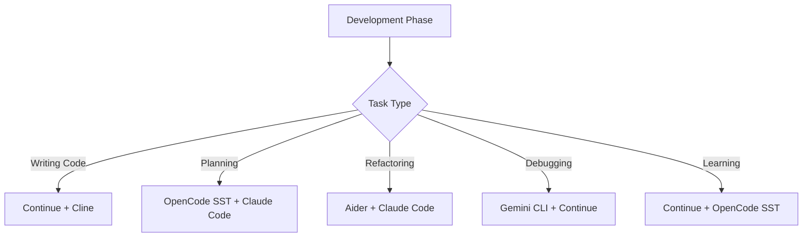

# AI Development Tools

Complete guide to AI coding assistants integrated with XaresAICoder.

## Table of Contents

- [Overview](#overview)  
- [VS Code Extensions](#vs-code-extensions)
- [Command Line Tools](#command-line-tools)
- [Setup Guide](#setup-guide)
- [Tool Comparison](#tool-comparison)
- [Best Practices](#best-practices)
- [Troubleshooting](#troubleshooting)

## Overview

XaresAICoder provides a curated selection of AI coding assistants that work seamlessly together in your development workspace. Each tool serves different use cases and can be combined for a comprehensive AI-enhanced development experience.

### Tool Categories

**🎯 VS Code Extensions** - Integrated directly into the editor
- **Continue** - AI code completion and chat
- **Cline (Claude Dev)** - AI file editing and automation

**⌨️ Command Line Tools** - Terminal-based AI assistants  
- **OpenCode SST** - Multi-model AI with project analysis
- **Aider** - AI pair programming with git integration
- **Gemini CLI** - Google's AI for code generation
- **Claude Code** - Anthropic's agentic coding tool

## VS Code Extensions

### Continue - AI Code Completion & Chat

**Best for**: Real-time code completion, inline suggestions, code explanation

#### Features
- ✅ **Inline Code Completion** - AI suggestions as you type
- ✅ **Sidebar Chat Interface** - Ask questions about your code
- ✅ **Multiple AI Providers** - OpenAI, Anthropic, local models
- ✅ **Context Awareness** - Understands your project structure
- ✅ **Code Explanation** - Explain existing code snippets

#### Installation
```bash
# Install from VS Code marketplace
code --install-extension continue.continue
```

#### Configuration
1. Open VS Code Command Palette (`Ctrl+Shift+P`)
2. Search for "Continue: Configure"
3. Choose your AI provider:
   - **OpenAI**: Requires API key from OpenAI
   - **Anthropic**: Requires API key from Anthropic  
   - **Local Models**: Use Ollama or other local inference

#### Usage Examples
```javascript
// Type a comment and Continue will suggest implementation
// Calculate fibonacci sequence
function fibonacci(n) {
  // AI will suggest the implementation
}

// Use the chat sidebar for questions:
// "How can I optimize this function?"
// "Explain what this regex does"
// "Convert this to TypeScript"
```

### Cline (Claude Dev) - AI File Editor

**Best for**: Complex refactoring, multi-file operations, automated development tasks

#### Features
- ✅ **Direct File Editing** - AI makes changes directly to your files
- ✅ **Multi-File Operations** - Coordinate changes across multiple files
- ✅ **Terminal Integration** - Execute commands and see results
- ✅ **Project Understanding** - Analyzes entire codebase
- ✅ **Task Automation** - Complete development tasks autonomously

#### Installation
```bash
# Install from VS Code marketplace
code --install-extension saoudrizwan.claude-dev
```

#### Setup
1. Install the extension
2. Get Claude API key from Anthropic Console
3. Open Command Palette (`Ctrl+Shift+P`)
4. Search for "Cline: Open"
5. Enter your API key when prompted

#### Usage Examples
- **Refactoring**: "Refactor this component to use React hooks"
- **Feature Development**: "Add user authentication to this Express app"
- **Bug Fixing**: "Fix the memory leak in this Python script"
- **Testing**: "Write comprehensive tests for this module"

## Command Line Tools

### OpenCode SST - Multi-Model AI Assistant

**Best for**: Project analysis, collaborative development, multi-model support

#### Features
- ✅ **Multi-Model Support** - Switch between different AI models
- ✅ **Project Analysis** - Deep understanding of project structure
- ✅ **Collaborative Sessions** - Share sessions with team members
- ✅ **Context Management** - Maintains conversation context
- ✅ **File Operations** - Read, write, and analyze files

#### Quick Setup
```bash
# Use the built-in setup command
setup_opencode

# Follow the interactive setup
```

#### Manual Setup
```bash
# Install OpenCode SST
curl -sSL https://install.opencodesst.com | bash

# Add to PATH (already done in XaresAICoder)
export PATH="$HOME/.opencode/bin:$PATH"

# Authenticate
opencode auth login

# Initialize project analysis
opencode
# Then type: /init
```

#### Key Commands
```bash
# Start interactive session
opencode

# Initialize project analysis
/init

# Share session for collaboration
/share

# Switch AI models
/model gpt-4
/model claude-3-sonnet

# Get help
/help
```

### Aider - AI Pair Programming

**Best for**: Interactive coding sessions, direct file editing, git integration

#### Features
- ✅ **Direct File Editing** - AI makes changes to your files
- ✅ **Git Integration** - Automatic commits with meaningful messages
- ✅ **Multiple AI Models** - OpenAI, Anthropic, Google, local models
- ✅ **Interactive Sessions** - Natural conversation about code
- ✅ **Codebase Understanding** - Works with existing projects

#### Setup
```bash
# Use the built-in setup command
setup_aider

# Set your API key (choose one)
export OPENAI_API_KEY=your_key_here
export ANTHROPIC_API_KEY=your_key_here
export GEMINI_API_KEY=your_key_here
```

#### Usage
```bash
# Start aider in your project directory
aider

# Add files to the session
aider main.py utils.py

# Use with specific model
aider --model gpt-4
aider --model claude-3-sonnet

# Auto-commit changes
aider --auto-commits
```

#### Example Session
```bash
$ aider main.py
Aider v0.35.0
Models: gpt-4 with whole edit format
Git repo: .git
Added main.py to the chat

> Add error handling to the database connection function

I'll add comprehensive error handling to your database connection function.

[Aider shows the changes and applies them]

> Run the tests to make sure it works

[Aider runs tests and shows results]
```

### Gemini CLI - Google's AI Assistant

**Best for**: Code generation, debugging, Google ecosystem integration

#### Features
- ✅ **Google's Gemini Model** - Advanced code understanding
- ✅ **Natural Language Interface** - Describe what you want
- ✅ **Code Generation** - Create new code from descriptions
- ✅ **Debugging Help** - Analyze and fix errors
- ✅ **Multi-Language Support** - Works with many programming languages

#### Setup
```bash
# Use the built-in setup command
setup_gemini

# Get API key from Google AI Studio
# https://makersuite.google.com/app/apikey

# Set your API key
export GEMINI_API_KEY=your_key_here
```

#### Usage
```bash
# Start interactive session
gemini

# Direct questions
gemini "How do I implement a REST API in Python?"

# Code analysis
gemini "Explain this code: $(cat main.py)"

# Debugging
gemini "Why is this function not working?" --file problematic_code.py
```

### Claude Code - Anthropic's Agentic Tool

**Best for**: Deep codebase understanding, multi-file editing, advanced workflows

#### Features
- ✅ **Codebase Intelligence** - Understands entire project structure
- ✅ **Multi-File Editing** - Coordinate changes across many files
- ✅ **Git Workflow Integration** - Automated git operations
- ✅ **Advanced Reasoning** - Complex problem solving and planning
- ✅ **Context Retention** - Maintains understanding across sessions

#### Setup
```bash
# Use the built-in setup command
setup_claude

# Requires Claude Pro/Max subscription or API billing
```

#### Usage
```bash
# Start agentic coding session
claude

# Example tasks:
# "Implement user authentication system"
# "Refactor this codebase to use microservices"
# "Add comprehensive testing to all modules"
# "Optimize the database schema and queries"
```

## Setup Guide

### Quick Setup for All Tools

```bash
# Run this command in your workspace terminal
setup_ai_tools
```

This command provides setup instructions for all available AI tools.

### Individual Tool Setup

#### 1. Get API Keys

**OpenAI**:
- Visit https://platform.openai.com/api-keys
- Create new API key
- Set: `export OPENAI_API_KEY=your_key_here`

**Anthropic (Claude)**:
- Visit https://console.anthropic.com/
- Create API key
- Set: `export ANTHROPIC_API_KEY=your_key_here`

**Google (Gemini)**:
- Visit https://makersuite.google.com/app/apikey
- Generate API key
- Set: `export GEMINI_API_KEY=your_key_here`

#### 2. Environment Variables

Add to your workspace's `.bashrc` or `.zshrc`:

```bash
# AI Tool API Keys
export OPENAI_API_KEY=your_openai_key
export ANTHROPIC_API_KEY=your_anthropic_key  
export GEMINI_API_KEY=your_gemini_key

# Tool-specific settings
export AIDER_AUTO_COMMITS=true
export OPENCODE_DEFAULT_MODEL=gpt-4
```

#### 3. Verify Installation

```bash
# Check tool availability
which opencode
which aider
which gemini
which claude

# Test API connections
opencode auth status
aider --version
gemini --help
```

## Tool Comparison

### Use Case Matrix

| Task | Continue | Cline | OpenCode | Aider | Gemini | Claude Code |
|------|----------|-------|----------|-------|--------|-------------|
| **Code Completion** | ⭐⭐⭐ | ⭐ | ⭐ | ⭐ | ⭐⭐ | ⭐ |
| **File Editing** | ⭐ | ⭐⭐⭐ | ⭐⭐ | ⭐⭐⭐ | ⭐ | ⭐⭐⭐ |
| **Project Analysis** | ⭐ | ⭐⭐ | ⭐⭐⭐ | ⭐⭐ | ⭐⭐ | ⭐⭐⭐ |
| **Git Integration** | ❌ | ⭐ | ❌ | ⭐⭐⭐ | ❌ | ⭐⭐⭐ |
| **Multi-File Ops** | ❌ | ⭐⭐⭐ | ⭐⭐ | ⭐⭐⭐ | ⭐ | ⭐⭐⭐ |
| **Learning Curve** | ⭐⭐⭐ | ⭐⭐ | ⭐⭐ | ⭐⭐ | ⭐⭐⭐ | ⭐ |

### Model Support

| Tool | OpenAI | Anthropic | Google | Local Models |
|------|--------|-----------|--------|--------------|
| **Continue** | ✅ | ✅ | ✅ | ✅ (Ollama) |
| **Cline** | ❌ | ✅ | ❌ | ❌ |
| **OpenCode** | ✅ | ✅ | ✅ | ✅ |
| **Aider** | ✅ | ✅ | ✅ | ✅ (Ollama) |
| **Gemini CLI** | ❌ | ❌ | ✅ | ❌ |
| **Claude Code** | ❌ | ✅ | ❌ | ❌ |

## Best Practices

### 1. Tool Selection Strategy

**For Different Development Phases**:



**Recommended Combinations**:
- **Beginner**: Continue + OpenCode SST
- **Intermediate**: Continue + Aider + Gemini CLI
- **Advanced**: All tools based on specific needs
- **Team Lead**: OpenCode SST + Claude Code + Aider

### 2. Workflow Integration

```bash
# Morning routine - start with project analysis
opencode
/init

# Development phase - use Continue for inline help
# (VS Code extension works automatically)

# Feature implementation - use Aider for structured development
aider main.py tests.py
> "Add user authentication with JWT tokens"

# Code review - use Cline for analysis
# (In VS Code: Ctrl+Shift+P -> "Cline: Analyze Code")

# Debugging - use Gemini for specific issues
gemini "Why does this function return None?" --file debug.py
```

### 3. Context Management

**Maintain Context Across Tools**:
- Use consistent variable names and patterns
- Document decisions in comments
- Keep related files together
- Use descriptive commit messages (Aider does this automatically)

**Example Context Flow**:
```bash
# 1. Analyze project structure
opencode
/init

# 2. Plan feature implementation  
> "I need to add user authentication. What's the best approach?"

# 3. Implement with structured editing
aider auth.py models.py routes.py
> "Implement the authentication system we discussed"

# 4. Get inline help while refining
# (Use Continue in VS Code for small adjustments)

# 5. Final review and optimization
claude
> "Review the authentication implementation and suggest improvements"
```

### 4. API Key Management

**Security Best Practices**:
```bash
# Store in environment files (not in code)
echo 'export OPENAI_API_KEY=your_key' >> ~/.bashrc

# Use different keys for different projects (if needed)
export PROJECT_A_OPENAI_KEY=key1
export PROJECT_B_OPENAI_KEY=key2

# Monitor usage in provider dashboards
# OpenAI: https://platform.openai.com/usage
# Anthropic: https://console.anthropic.com/
```

### 5. Cost Optimization

**Token Usage Tips**:
- Use Continue for simple completions (lower cost)
- Use Claude Code for complex multi-file operations (higher value)
- Limit context size in long conversations
- Use local models for experimentation

**Budget Management**:
```bash
# Set usage limits in provider dashboards
# Monitor costs regularly
# Use cheaper models for simple tasks
aider --model gpt-3.5-turbo  # Instead of gpt-4 for simple tasks
```

## Troubleshooting

### Common Issues

#### API Key Problems
```bash
# Check if keys are set
env | grep -E "(OPENAI|ANTHROPIC|GEMINI)_API_KEY"

# Test API connection
curl https://api.openai.com/v1/models \
  -H "Authorization: Bearer $OPENAI_API_KEY"

# Reset authentication
opencode auth logout
opencode auth login
```

#### Tool Not Found
```bash
# Check if tool is in PATH
which aider
which opencode

# Reinstall if needed
setup_aider
setup_opencode
```

#### VS Code Extension Issues
```bash
# Reload VS Code window
# Ctrl+Shift+P -> "Developer: Reload Window"

# Check extension is installed
code --list-extensions | grep -E "(continue|claude-dev)"

# Reinstall extension
code --uninstall-extension continue.continue
code --install-extension continue.continue
```

#### Model/API Errors
```bash
# Check model availability
aider --models

# Use different model
aider --model gpt-3.5-turbo

# Check API status
curl https://status.openai.com/api/v2/status.json
```

### Performance Issues

#### Slow Responses
- Use smaller context windows
- Choose faster models (gpt-3.5-turbo vs gpt-4)
- Limit file sizes in conversations
- Use local models for simple tasks

#### High Token Usage
- Be specific in prompts
- Use targeted file selection
- Clear conversation history regularly
- Monitor usage in dashboards

### Tool-Specific Issues

#### Continue Extension
```bash
# Clear extension cache
rm -rf ~/.vscode-server/extensions/continue.continue*

# Reset configuration
# Delete: .vscode/settings.json Continue settings
```

#### Aider Problems
```bash
# Update aider
pip install --upgrade aider-chat

# Clear aider cache
rm -rf ~/.aider

# Check git status
git status  # Aider needs clean working directory
```

#### OpenCode SST Issues
```bash
# Reinstall OpenCode
curl -sSL https://install.opencodesst.com | bash

# Check authentication
opencode auth status

# Reset project analysis
rm -rf .opencode
opencode
/init
```

### Getting Help

1. **Tool Documentation**:
   - Continue: https://continue.dev/docs
   - Aider: https://aider.chat/docs/
   - OpenCode SST: Built-in `/help` command

2. **Community Support**:
   - GitHub issues for each tool
   - Discord communities
   - Stack Overflow

3. **XaresAICoder Support**:
   - Check [Troubleshooting Guide](TROUBLESHOOTING.md)
   - GitHub issues for platform-specific problems

---

[← Back to API Reference](API.md) | [Next: Security →](SECURITY.md)