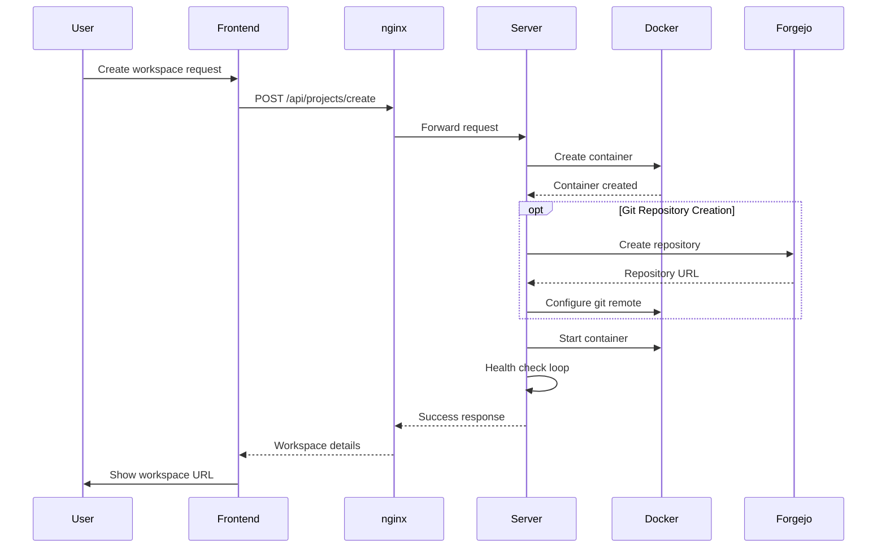
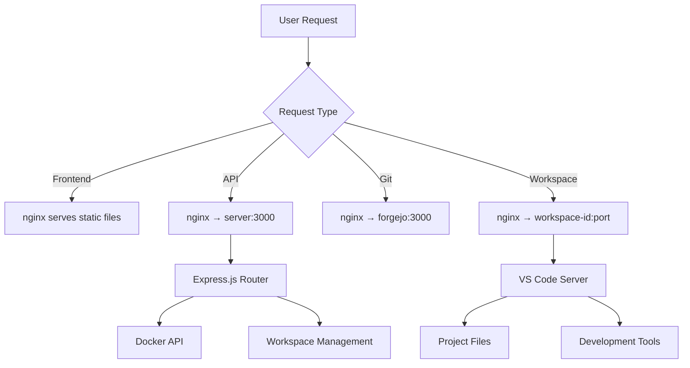

# Architecture Overview

Technical architecture and components of XaresAICoder platform.

## Table of Contents

- [System Architecture](#system-architecture)
- [Service Components](#service-components)
- [Network Architecture](#network-architecture)
- [Container Orchestration](#container-orchestration)
- [Data Flow](#data-flow)
- [Security Architecture](#security-architecture)
- [Scalability Design](#scalability-design)
- [Technology Stack](#technology-stack)

## System Architecture

XaresAICoder follows a microservices architecture with containerized components orchestrated by Docker Compose.

```
┌─────────────────────────────────────────────────────────────┐
│                        Internet                             │
└─────────────────────┬───────────────────────────────────────┘
                      │
                      ▼
┌─────────────────────────────────────────────────────────────┐
│                   nginx (Reverse Proxy)                    │
│  ┌─────────┐ ┌─────────────┐ ┌────────────────────────────┐ │
│  │Frontend │ │ API Server  │ │ Workspace Subdomains       │ │
│  │   /     │ │ /api/*      │ │ projectid-port.domain      │ │
│  └─────────┘ └─────────────┘ └────────────────────────────┘ │
└─────────────────────┬───────────────────────────────────────┘
                      │
        ┌─────────────┼─────────────┐
        │             │             │
        ▼             ▼             ▼
┌─────────────┐ ┌─────────────┐ ┌─────────────────┐
│   Server    │ │   Forgejo   │ │    Workspaces   │
│ (Node.js)   │ │ (Git Server)│ │  (code-server)  │
│             │ │  Optional   │ │    Dynamic      │
└─────────────┘ └─────────────┘ └─────────────────┘
        │             │             │
        ▼             ▼             ▼
┌─────────────┐ ┌─────────────┐ ┌─────────────────┐
│  Docker     │ │ Forgejo     │ │  Workspace      │
│  Socket     │ │ Data        │ │  Volumes        │
└─────────────┘ └─────────────┘ └─────────────────┘
```

## Service Components

### 1. nginx (Reverse Proxy)

**Purpose**: Request routing and load balancing
**Image**: `nginx:alpine`
**Port**: 80/443 (configurable)

**Responsibilities**:
- Route requests to appropriate services
- Serve static frontend files
- Handle subdomain-based workspace routing
- SSL termination (in production setups)
- WebSocket proxy for VS Code

**Configuration**:
```nginx
# Frontend
location / {
    root /usr/share/nginx/html;
    try_files $uri $uri/ /index.html;
}

# API routes
location /api/ {
    proxy_pass http://server:3000;
    proxy_set_header Host $host;
}

# Workspace subdomains
server {
    server_name ~^(?<project>[^-]+)-(?<port>\d+)\.;
    location / {
        proxy_pass http://workspace-$project:$port;
        proxy_set_header Host $host;
        proxy_set_header Upgrade $http_upgrade;
        proxy_set_header Connection "upgrade";
    }
}
```

### 2. Server (API Backend)

**Purpose**: Project management and container orchestration
**Image**: `node:18-alpine`
**Port**: 3000 (internal)

**Responsibilities**:
- Workspace lifecycle management
- Docker container orchestration
- Real-time status monitoring
- API endpoint provision
- Health check coordination
- Git repository creation

**Key Modules**:
- `src/index.js` - Main Express server
- `src/routes/` - API endpoint definitions
- `src/services/docker.js` - Docker integration
- `src/services/workspace.js` - Workspace management
- `src/services/git.js` - Git server integration

### 3. Workspaces (code-server)

**Purpose**: VS Code development environments
**Image**: Custom `xares-aicoder-codeserver:latest`
**Ports**: Dynamic assignment

**Responsibilities**:
- VS Code in browser
- Development environment setup
- AI tools integration
- Port forwarding management
- Project template initialization

**Base Image Stack**:
```dockerfile
FROM codercom/code-server:latest
# Node.js, Python, Java, Git
# AI Tools: OpenCode SST, setup scripts
# VS Code extensions and configuration
```

### 4. Forgejo (Git Server) - Optional

**Purpose**: Self-hosted Git repository management
**Image**: `codeberg.org/forgejo/forgejo:9`
**Port**: 3000 (internal)

**Responsibilities**:
- Git repository hosting
- Web-based Git interface
- GitHub Actions compatible CI/CD
- User and organization management
- API-compatible with GitHub

## Network Architecture

### Docker Network Configuration

```yaml
networks:
  xares-aicoder-network:
    name: xares-aicoder-network
    driver: bridge
    ipam:
      config:
        - subnet: 172.19.0.0/16
          gateway: 172.19.0.1
```

**Network Benefits**:
- ✅ Persistent across container restarts
- ✅ Isolated from other Docker networks
- ✅ Automatic service discovery
- ✅ Conflict detection and resolution

### Service Communication

```
nginx ←→ server (HTTP/REST API)
nginx ←→ forgejo (HTTP/Git protocol)
nginx ←→ workspaces (HTTP/WebSocket)
server ←→ docker.sock (Docker API)
server ←→ forgejo (HTTP API)
workspaces ←→ forgejo (Git protocol)
```

### Port Management

| Service | Internal Port | External Access |
|---------|---------------|-----------------|
| nginx | 80/443 | Direct (configurable) |
| server | 3000 | Via nginx `/api/*` |
| forgejo | 3000 | Via nginx `/git/*` |
| workspaces | 8080 | Via nginx subdomain |

## Container Orchestration

### Service Dependencies

```yaml
services:
  server:
    depends_on: []
    
  nginx:
    depends_on:
      - server
      
  forgejo:
    depends_on: []
    profiles: ["git-server"]
```

### Resource Allocation

**Per Workspace Container**:
```yaml
deploy:
  resources:
    limits:
      cpus: '2.0'
      memory: 4G
      pids: 512
    reservations:
      memory: 1G
```

**System Services**:
- nginx: 128MB RAM, 0.1 CPU
- server: 512MB RAM, 0.5 CPU  
- forgejo: 1GB RAM, 0.5 CPU

### Volume Management

```yaml
volumes:
  # Persistent data
  forgejo_data:
    driver: local
    
  # Workspace storage (per container)
  workspace_data:
    driver: local
    
  # Docker socket access
  /var/run/docker.sock:/var/run/docker.sock:ro
```

## Data Flow

### Workspace Creation Flow



### Request Routing Flow



## Security Architecture

### Container Isolation

```yaml
# Workspace security
security_opt:
  - no-new-privileges:true
user: "1000:1000"  # Non-root user
read_only: false   # Development needs write access
tmpfs:
  - /tmp:size=1G,noexec,nosuid,nodev
```

### Network Security

- **Isolated Networks**: Services communicate only within Docker network
- **No Direct Exposure**: Only nginx exposed to host network
- **Internal DNS**: Services use container names for communication
- **Port Isolation**: Workspace ports only accessible via proxy

### Data Security

- **Volume Isolation**: Each workspace has isolated storage
- **Secret Management**: API keys stored only in workspace containers
- **Password Protection**: Optional workspace-level authentication
- **No Persistence**: Sensitive data not stored in platform database

## Scalability Design

### Horizontal Scaling Considerations

**Current Limitations** (Single Node):
- Docker socket binding limits to single host
- Local volume storage
- No distributed state management

**Future Scaling Options**:
- Docker Swarm mode for multi-node deployment
- Kubernetes orchestration
- External volume storage (NFS, cloud storage)
- Database-backed state management

### Performance Characteristics

**Workspace Startup Time**:
- Empty Project: ~10-15 seconds
- Python Flask: ~15-20 seconds
- Node.js React: ~20-25 seconds
- Java Spring Boot: ~30-60 seconds

**Resource Usage** (per workspace):
- Idle: ~300MB RAM, 0.1 CPU
- Active Development: ~1-2GB RAM, 0.5-1.0 CPU
- Build Operations: ~2-4GB RAM, 1-2 CPU

### Optimization Strategies

**Image Optimization**:
- Multi-stage Docker builds
- Layer caching for faster rebuilds
- Pre-installed common tools
- Optimized base image size

**Runtime Optimization**:
- Container resource limits
- Automatic cleanup of inactive workspaces
- Health check optimization
- Network routing efficiency

## Technology Stack

### Backend Technologies

| Component | Technology | Version | Purpose |
|-----------|------------|---------|---------|
| **API Server** | Node.js | 18+ | Backend runtime |
| **Web Framework** | Express.js | 4.x | HTTP server and routing |
| **Container Management** | Dockerode | 3.x | Docker API integration |
| **Process Management** | PM2 | 5.x | Production process manager |

### Frontend Technologies

| Component | Technology | Version | Purpose |
|-----------|------------|---------|---------|
| **UI Framework** | Vanilla JS | ES6+ | Lightweight frontend |
| **HTTP Client** | Fetch API | Native | API communication |
| **CSS Framework** | Custom CSS | - | VS Code inspired styling |
| **PWA Features** | Service Worker | Native | Offline capability |

### Infrastructure Technologies

| Component | Technology | Version | Purpose |
|-----------|------------|---------|---------|
| **Reverse Proxy** | nginx | 1.24+ | Request routing |
| **Container Runtime** | Docker | 20.10+ | Container execution |
| **Orchestration** | Docker Compose | 2.x | Service coordination |
| **Development Environment** | code-server | 4.x | VS Code in browser |
| **Git Server** | Forgejo | 9.x | Git repository hosting |

### Development Tools Integration

| Tool | Type | Installation | Purpose |
|------|------|--------------|---------|
| **Continue** | VS Code Extension | Marketplace | AI code completion |
| **Cline** | VS Code Extension | Marketplace | AI file editing |
| **OpenCode SST** | CLI Tool | Custom installer | Multi-model AI assistant |
| **Aider** | CLI Tool | pip install | AI pair programming |
| **Gemini CLI** | CLI Tool | npm install | Google AI integration |
| **Claude Code** | CLI Tool | Download | Anthropic's agentic tool |

### Monitoring and Observability

**Current Capabilities**:
- Docker container status monitoring
- Health check endpoints
- Resource usage tracking
- Log aggregation via Docker

**Future Enhancements**:
- Prometheus metrics collection
- Grafana dashboards
- Distributed tracing
- Performance monitoring

---

[← Back to Installation](INSTALLATION.md) | [Next: Project Templates →](PROJECT_TEMPLATES.md)