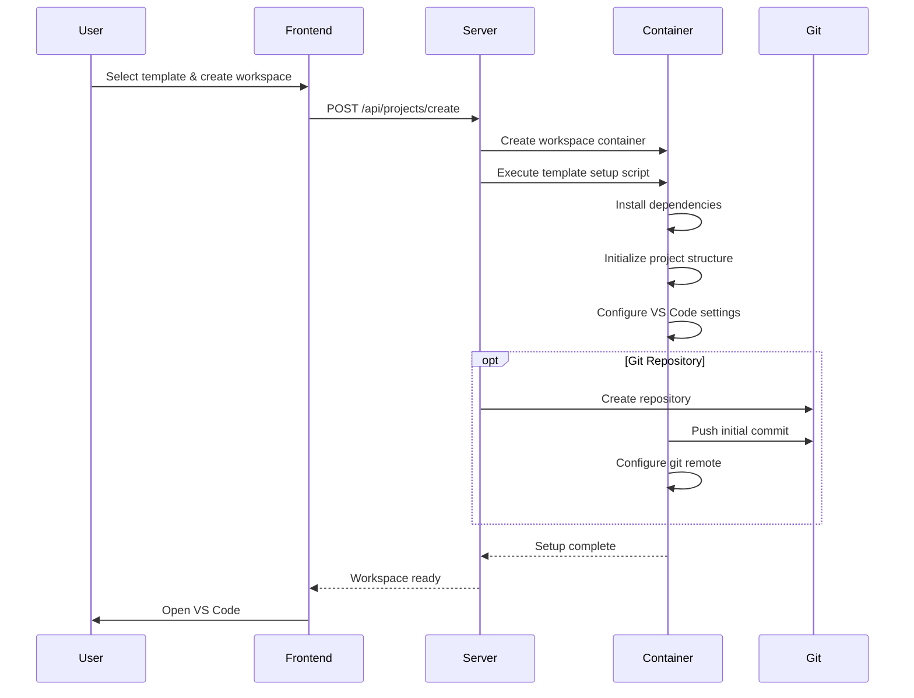

# Project Templates

Complete guide to XaresAICoder project templates and customization.

## Table of Contents

- [Template Overview](#template-overview)
- [Empty Project](#empty-project)
- [Python Flask](#python-flask)
- [Node.js React](#nodejs-react)
- [Java Spring Boot](#java-spring-boot)
- [Template Features](#template-features)
- [Customization](#customization)
- [Adding New Templates](#adding-new-templates)

## Template Overview

XaresAICoder provides professionally crafted project templates that include:
- ✅ **Complete project scaffolding** with best practices
- ✅ **Development server setup** with auto-reload
- ✅ **VS Code workspace configuration** optimized for each technology
- ✅ **Git repository initialization** with meaningful first commit
- ✅ **Port forwarding configuration** for seamless application access
- ✅ **Package management** setup (pip, npm, maven)
- ✅ **Welcome applications** demonstrating key concepts
- ✅ **Debugging configuration** for VS Code
- ✅ **README files** with getting started instructions

## Empty Project

**Perfect for**: Starting from scratch, learning new technologies, custom project structures

### What's Included

```
my-project/
├── README.md                 # Comprehensive getting started guide
├── .gitignore               # Multi-language patterns
├── .vscode/
│   ├── settings.json        # Optimized workspace settings
│   ├── extensions.json      # Recommended extensions
│   └── tasks.json          # Common development tasks
└── docs/
    └── GETTING_STARTED.md   # Development workflow guide
```

### Features

- **Multi-language .gitignore**: Covers Python, Node.js, Java, Go, Rust, and more
- **VS Code Configuration**: Optimized settings for productivity
- **Port Forwarding**: Pre-configured for common development ports (3000, 5000, 8000, 8080, 4200)
- **Extension Recommendations**: Curated list of helpful VS Code extensions
- **Documentation Template**: Structured documentation starting point

### VS Code Settings

```json
{
  "editor.formatOnSave": true,
  "editor.codeActionsOnSave": {
    "source.organizeImports": true
  },
  "remote.autoForwardPorts": true,
  "remote.portsAttributes": {
    "3000": {"label": "Development Server"},
    "5000": {"label": "Flask/Python App"},
    "8000": {"label": "Django/HTTP Server"},
    "8080": {"label": "Spring Boot/Tomcat"}
  }
}
```

### Getting Started

1. Open the integrated terminal
2. Choose your technology stack
3. Initialize your project structure
4. Start developing with AI assistance

## Python Flask

**Perfect for**: Web applications, APIs, data science projects, rapid prototyping

### What's Included

```
my-flask-app/
├── app.py                   # Main Flask application
├── requirements.txt         # Python dependencies
├── .env.example            # Environment variables template
├── README.md               # Flask-specific documentation
├── .gitignore              # Python-focused patterns
├── .vscode/
│   ├── settings.json       # Python development settings
│   ├── launch.json         # Debug configuration
│   └── extensions.json     # Python extension recommendations
├── static/
│   ├── css/
│   │   └── style.css       # Professional styling
│   └── js/
│       └── main.js         # Frontend JavaScript
├── templates/
│   ├── base.html           # Base template with Bootstrap
│   ├── index.html          # Welcome page
│   └── about.html          # About page example
└── venv/                   # Virtual environment (created on setup)
```

### Pre-installed Dependencies

```python
# requirements.txt
Flask==2.3.3
python-dotenv==1.0.0
gunicorn==21.2.0          # Production WSGI server
flask-cors==4.0.0         # CORS support for APIs
requests==2.31.0          # HTTP requests
```

### Sample Application

```python
# app.py
from flask import Flask, render_template, jsonify
from dotenv import load_dotenv
import os

load_dotenv()

app = Flask(__name__)

@app.route('/')
def home():
    return render_template('index.html', 
                         title='XaresAICoder Flask Template')

@app.route('/api/health')
def health():
    return jsonify({
        'status': 'healthy',
        'message': 'Flask application is running!'
    })

if __name__ == '__main__':
    app.run(host='0.0.0.0', port=5000, debug=True)
```

### Development Workflow

1. **Virtual Environment**: Automatically created and activated
2. **Dependencies**: Installed via `pip install -r requirements.txt`
3. **Development Server**: Runs on port 5000 with auto-reload
4. **Debug Configuration**: VS Code debugging ready to use
5. **Port Forwarding**: Automatic browser opening at `projectid-5000.localhost`

### Debugging Setup

```json
{
  "name": "Python: Flask",
  "type": "python",
  "request": "launch",
  "program": "${workspaceFolder}/app.py",
  "env": {
    "FLASK_ENV": "development",
    "FLASK_DEBUG": "1"
  },
  "args": [],
  "jinja": true
}
```

## Node.js React

**Perfect for**: Modern web applications, SPAs, full-stack JavaScript development

### What's Included

```
my-react-app/
├── package.json            # Project dependencies and scripts
├── package-lock.json       # Dependency lock file
├── vite.config.js          # Vite build configuration
├── index.html              # HTML entry point
├── README.md               # React-specific documentation
├── .gitignore              # Node.js focused patterns
├── .vscode/
│   ├── settings.json       # JavaScript/TypeScript settings
│   ├── launch.json         # Debug configuration
│   └── extensions.json     # React extension recommendations
├── src/
│   ├── main.jsx            # Application entry point
│   ├── App.jsx             # Main App component
│   ├── App.css             # Component styles
│   ├── index.css           # Global styles
│   └── components/
│       ├── Header.jsx      # Header component
│       ├── Welcome.jsx     # Welcome page component
│       └── ApiDemo.jsx     # API integration example
├── public/
│   ├── favicon.ico         # Application favicon
│   └── logo.svg            # React logo
└── node_modules/           # Dependencies (created on setup)
```

### Technology Stack

```json
{
  "dependencies": {
    "react": "^18.2.0",
    "react-dom": "^18.2.0",
    "react-router-dom": "^6.15.0"
  },
  "devDependencies": {
    "@types/react": "^18.2.15",
    "@types/react-dom": "^18.2.7",
    "@vitejs/plugin-react": "^4.0.3",
    "vite": "^4.4.5",
    "eslint": "^8.45.0",
    "eslint-plugin-react": "^7.32.2",
    "eslint-plugin-react-hooks": "^4.6.0"
  }
}
```

### Sample Application

```jsx
// src/App.jsx
import React, { useState, useEffect } from 'react';
import Header from './components/Header';
import Welcome from './components/Welcome';
import ApiDemo from './components/ApiDemo';
import './App.css';

function App() {
  const [currentView, setCurrentView] = useState('welcome');

  return (
    <div className="App">
      <Header onNavigate={setCurrentView} />
      <main>
        {currentView === 'welcome' && <Welcome />}
        {currentView === 'api' && <ApiDemo />}
      </main>
    </div>
  );
}

export default App;
```

### Development Features

- **Vite Build Tool**: Fast development server with HMR
- **TypeScript Support**: Ready for TypeScript development
- **ESLint Configuration**: Code quality and consistency
- **Component Examples**: Professional component structure
- **API Integration**: Example API calls and state management
- **Responsive Design**: Mobile-first responsive layout

### Development Scripts

```json
{
  "scripts": {
    "dev": "vite --host 0.0.0.0 --port 3000",
    "build": "vite build",
    "lint": "eslint . --ext js,jsx --report-unused-disable-directives --max-warnings 0",
    "preview": "vite preview"
  }
}
```

## Java Spring Boot

**Perfect for**: Enterprise applications, microservices, REST APIs, complex business logic

### What's Included

```
my-spring-app/
├── pom.xml                 # Maven project configuration
├── mvnw                    # Maven wrapper script
├── mvnw.cmd               # Maven wrapper (Windows)
├── README.md              # Spring Boot documentation
├── .gitignore             # Java focused patterns
├── .vscode/
│   ├── settings.json      # Java development settings
│   ├── launch.json        # Debug configuration
│   └── extensions.json    # Java extension recommendations
└── src/
    ├── main/
    │   ├── java/
    │   │   └── com/example/demo/
    │   │       ├── DemoApplication.java    # Main application class
    │   │       ├── controller/
    │   │       │   └── HomeController.java # REST controller
    │   │       ├── service/
    │   │       │   └── GreetingService.java # Business logic
    │   │       └── model/
    │   │           └── Greeting.java       # Data model
    │   └── resources/
    │       ├── application.properties      # Configuration
    │       ├── static/                     # Static web assets
    │       └── templates/                  # Thymeleaf templates
    └── test/
        └── java/
            └── com/example/demo/
                └── DemoApplicationTests.java # Unit tests
```

### Maven Configuration

```xml
<!-- pom.xml -->
<dependencies>
    <dependency>
        <groupId>org.springframework.boot</groupId>
        <artifactId>spring-boot-starter-web</artifactId>
    </dependency>
    <dependency>
        <groupId>org.springframework.boot</groupId>
        <artifactId>spring-boot-starter-thymeleaf</artifactId>
    </dependency>
    <dependency>
        <groupId>org.springframework.boot</groupId>
        <artifactId>spring-boot-devtools</artifactId>
        <scope>runtime</scope>
    </dependency>
    <dependency>
        <groupId>org.springframework.boot</groupId>
        <artifactId>spring-boot-starter-test</artifactId>
        <scope>test</scope>
    </dependency>
</dependencies>
```

### Sample Application

```java
// src/main/java/com/example/demo/controller/HomeController.java
@RestController
@RequestMapping("/api")
public class HomeController {
    
    @Autowired
    private GreetingService greetingService;
    
    @GetMapping("/greeting")
    public Greeting greeting(@RequestParam(defaultValue = "World") String name) {
        return greetingService.createGreeting(name);
    }
    
    @GetMapping("/health")
    public Map<String, String> health() {
        Map<String, String> status = new HashMap<>();
        status.put("status", "healthy");
        status.put("message", "Spring Boot application is running!");
        return status;
    }
}
```

### Development Features

- **Spring Boot 3.1+**: Latest Spring framework
- **Java 17**: Modern Java features
- **Maven Wrapper**: Consistent build environment
- **Spring DevTools**: Hot reloading for development
- **Thymeleaf Templates**: Server-side rendering
- **Comprehensive Testing**: Unit and integration test setup
- **Production Ready**: Actuator endpoints for monitoring

### VS Code Java Extensions

```json
{
  "recommendations": [
    "vscjava.vscode-java-pack",
    "vmware.vscode-spring-boot",
    "vscjava.vscode-spring-boot-dashboard",
    "gabrielbb.vscode-lombok"
  ]
}
```

## Template Features

### Common Features Across All Templates

#### 1. Git Integration
- **Automatic Initialization**: `git init` with initial commit
- **Proper .gitignore**: Technology-specific ignore patterns
- **Git Remote Setup**: Auto-configured with Git server (if enabled)
- **Meaningful Commits**: Descriptive commit messages

#### 2. VS Code Configuration
- **Workspace Settings**: Optimized for each technology
- **Debug Configuration**: Ready-to-use debug setups
- **Extension Recommendations**: Curated extension lists
- **Task Configuration**: Common development tasks

#### 3. Port Forwarding
- **Automatic Detection**: VS Code detects running services
- **Subdomain Routing**: Clean URLs via subdomain routing
- **One-Click Access**: Browser opens automatically
- **Multiple Ports**: Support for frontend, backend, and services

#### 4. Documentation
- **README Files**: Getting started guides
- **Code Comments**: Well-documented example code
- **Best Practices**: Following industry standards
- **Development Workflows**: Clear development processes

### Template Initialization Process



## Customization

### Modifying Existing Templates

1. **Edit Template Scripts**: Modify files in `code-server/setup-scripts/`
2. **Update Dependencies**: Change package files (requirements.txt, package.json, pom.xml)
3. **Customize Configuration**: Modify VS Code settings and launch configurations
4. **Rebuild Image**: Run `./deploy.sh --build-only` to apply changes

### Template Configuration Files

```bash
code-server/setup-scripts/
├── workspace-init.sh        # Main initialization script
├── templates/
│   ├── empty/              # Empty project template files
│   ├── python-flask/       # Flask template files
│   ├── nodejs-react/       # React template files
│   └── java-spring/        # Spring Boot template files
└── setup-functions.sh      # Common setup functions
```

### Environment Variables

Templates can use environment variables for customization:

```bash
# Available in template scripts
PROJECT_NAME="my-project"
PROJECT_TYPE="python-flask"  
WORKSPACE_ID="workspace-abc123"
VSCODE_PROXY_URI="http://workspace-abc123-5000.localhost/"
PROXY_DOMAIN="workspace-abc123.localhost"
```

## Adding New Templates

### 1. Create Template Files

```bash
mkdir -p code-server/setup-scripts/templates/my-template
cd code-server/setup-scripts/templates/my-template

# Add your template files
touch README.md
touch main.py  # or main.js, Main.java, etc.
```

### 2. Update Initialization Script

Edit `code-server/setup-scripts/workspace-init.sh`:

```bash
setup_my_template() {
    local project_name="$1"
    
    echo "Setting up My Template project: $project_name"
    
    # Copy template files
    cp -r /home/coder/setup-scripts/templates/my-template/* .
    
    # Install dependencies
    pip install -r requirements.txt  # or npm install, mvn install
    
    # Configure development environment
    setup_vscode_settings "my-template"
    
    # Initialize project
    # Add your specific setup logic
    
    echo "My Template project setup complete!"
}
```

### 3. Update Server Configuration

Edit `server/src/services/workspace.js`:

```javascript
const VALID_PROJECT_TYPES = [
    'empty', 
    'python-flask', 
    'nodejs-react', 
    'java-spring',
    'my-template'  // Add your template
];
```

### 4. Update Frontend

Edit `frontend/index.html`:

```html
<select id="projectType" required>
    <option value="">Select Project Type</option>
    <option value="empty">Empty Project</option>
    <option value="python-flask">Python Flask</option>
    <option value="nodejs-react">Node.js React</option>
    <option value="java-spring">Java Spring Boot</option>
    <option value="my-template">My Template</option>
</select>
```

### 5. Rebuild and Test

```bash
# Rebuild code-server image
./deploy.sh --build-only

# Test the new template
# Create a workspace with your new template type
```

### Template Best Practices

1. **Follow Conventions**: Use established project structure patterns
2. **Include Documentation**: Provide clear README and getting started guides
3. **Configure VS Code**: Set up appropriate workspace settings and extensions
4. **Handle Dependencies**: Ensure all dependencies are properly installed
5. **Test Thoroughly**: Verify the template works in different scenarios
6. **Port Configuration**: Set up appropriate port forwarding
7. **Git Integration**: Ensure proper git initialization and ignore patterns

---

[← Back to Architecture](ARCHITECTURE.md) | [Next: API Reference →](API.md)