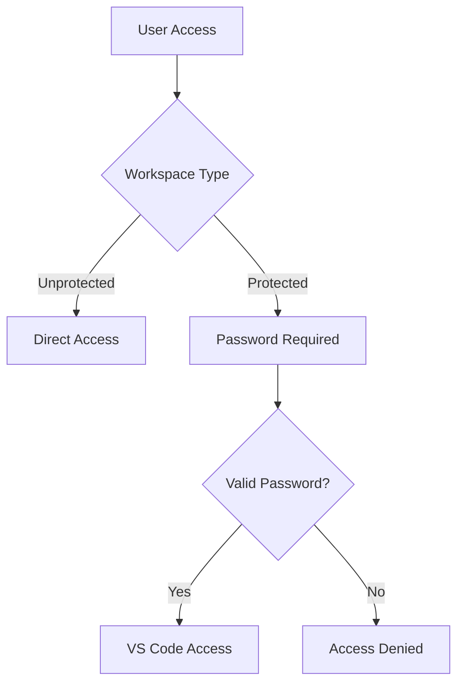

# Security Features

Comprehensive security guide for XaresAICoder platform.

## Table of Contents

- [Security Overview](#security-overview)
- [Workspace Security](#workspace-security)
- [Container Isolation](#container-isolation)
- [Network Security](#network-security)
- [Data Protection](#data-protection)
- [Authentication](#authentication)
- [Best Practices](#best-practices)
- [Security Configuration](#security-configuration)
- [Monitoring](#monitoring)
- [Incident Response](#incident-response)

## Security Overview

XaresAICoder implements a multi-layered security approach focusing on:
- ✅ **Container Isolation** - Each workspace runs in isolated containers
- ✅ **Optional Password Protection** - Workspace-level authentication
- ✅ **Network Segmentation** - Isolated Docker networks
- ✅ **Resource Limits** - Prevent resource exhaustion attacks
- ✅ **No Root Access** - Non-privileged container execution
- ✅ **Data Isolation** - Separate storage for each workspace

### Security Principles

1. **Defense in Depth** - Multiple security layers
2. **Principle of Least Privilege** - Minimal required access
3. **Isolation by Default** - Workspaces cannot access each other
4. **User-Controlled Security** - Optional protection levels
5. **Transparency** - Clear security boundaries and limitations

## Workspace Security

### Password Protection

**Per-Workspace Control**: Security is configurable per workspace rather than platform-wide.

#### Creating Protected Workspaces

```json
{
  "projectName": "secure-project",
  "projectType": "python-flask",
  "passwordProtected": true,
  "password": "MySecurePassword123!"
}
```

#### Password Requirements

- **Minimum Length**: 8 characters
- **Recommended**: 12+ characters with mixed case, numbers, symbols
- **Auto-Generated**: Secure 12-character passwords available
- **Custom Passwords**: User-defined passwords supported

#### Password Storage

```javascript
// Server-side (memory only, not persisted)
const workspacePasswords = new Map();
workspacePasswords.set(workspaceId, hashedPassword);

// Passwords are hashed using bcrypt
const bcrypt = require('bcrypt');
const hashedPassword = await bcrypt.hash(password, 12);
```

**Security Features**:
- ✅ **Bcrypt Hashing** - Industry-standard password hashing
- ✅ **Memory Storage** - Passwords not persisted to disk
- ✅ **Salt Rounds**: 12 rounds for strong protection
- ✅ **Session Timeout** - Protection expires with container

#### Protected Operations

Operations requiring password verification:
- **Workspace Access** - VS Code authentication prompt
- **Stop Workspace** - API requires password
- **Delete Workspace** - API requires password

```bash
# Stop protected workspace
curl -X POST http://localhost/api/projects/abc123/stop \
  -H "Content-Type: application/json" \
  -d '{"password": "MySecurePassword123!"}'
```

### Visual Security Indicators

- **🔒 Lock Icons** - Protected workspaces show lock symbols
- **Password Prompts** - Clear authentication requirements
- **Status Messages** - Security status in project lists

## Container Isolation

### Docker Security Configuration

```yaml
# Container security settings
services:
  workspace-${PROJECT_ID}:
    security_opt:
      - no-new-privileges:true    # Prevent privilege escalation
    user: "1000:1000"            # Non-root user execution
    read_only: false             # Development needs write access
    tmpfs:
      - /tmp:size=1G,noexec,nosuid,nodev
```

### Resource Limits

```yaml
deploy:
  resources:
    limits:
      cpus: '2.0'               # Maximum CPU cores
      memory: 4G                # Maximum RAM
      pids: 512                 # Maximum processes
    reservations:
      memory: 1G                # Guaranteed RAM
```

**Protection Against**:
- CPU exhaustion attacks
- Memory bombs
- Fork bombs
- Resource starvation

### File System Security

```yaml
volumes:
  # Each workspace has isolated storage
  - workspace_data_${PROJECT_ID}:/home/coder/project
  
tmpfs:
  # Temporary storage with security restrictions
  - /tmp:size=1G,noexec,nosuid,nodev
```

**Features**:
- **Isolated Storage** - Workspaces cannot access each other's files
- **Temporary File Restrictions** - No executable files in /tmp
- **Volume Encryption** - Host-level encryption support
- **Backup Isolation** - Separate backup policies per workspace

### Network Isolation

```yaml
networks:
  xares-aicoder-network:
    driver: bridge
    internal: false              # Internet access allowed
    ipam:
      config:
        - subnet: 172.19.0.0/16  # Isolated subnet
```

**Network Security**:
- **Isolated Subnet** - Separate from host network
- **Service Discovery** - Container name resolution only
- **Port Isolation** - Ports only accessible via proxy
- **No Direct Access** - External access only through nginx

## Network Security

### Reverse Proxy Configuration

```nginx
# nginx security headers
add_header X-Frame-Options DENY;
add_header X-Content-Type-Options nosniff;
add_header X-XSS-Protection "1; mode=block";
add_header Referrer-Policy strict-origin-when-cross-origin;

# Workspace access control
location ~* ^/(?<workspace>[a-zA-Z0-9-]+)\.(?<domain>[^/]+)/ {
    # Validate workspace ID format
    if ($workspace !~ ^[a-zA-Z0-9]{12}$) {
        return 403;
    }
    
    proxy_pass http://workspace-$workspace:8080;
    proxy_set_header Host $host;
    proxy_set_header X-Real-IP $remote_addr;
}
```

### Port Security

**Port Allocation**:
- **Dynamic Assignment** - Ports assigned per workspace
- **Range Restrictions** - Only allowed port ranges
- **Proxy-Only Access** - No direct port exposure
- **Automatic Cleanup** - Ports released when workspace stops

```javascript
// Port validation in server
const ALLOWED_PORTS = [3000, 5000, 8000, 8080, 4200, 9000];
const isValidPort = (port) => ALLOWED_PORTS.includes(parseInt(port));
```

### SSL/TLS (Production)

For production deployments with HTTPS:

```nginx
# SSL configuration
ssl_protocols TLSv1.2 TLSv1.3;
ssl_ciphers ECDHE-RSA-AES256-GCM-SHA512:DHE-RSA-AES256-GCM-SHA512;
ssl_prefer_server_ciphers off;
ssl_session_cache shared:SSL:10m;
ssl_session_timeout 10m;

# HSTS header
add_header Strict-Transport-Security "max-age=31536000; includeSubDomains" always;
```

## Data Protection

### Data Classification

| Data Type | Location | Protection Level | Retention |
|-----------|----------|------------------|-----------|
| **Workspace Code** | Container volumes | Isolated | Until deletion |
| **API Keys** | Container environment | User-managed | Session-based |
| **Passwords** | Server memory | Hashed | Non-persistent |
| **System Logs** | Host filesystem | Standard | Configurable |
| **Git Repositories** | Forgejo volumes | Git server auth | Persistent |

### Data Isolation

```bash
# Each workspace has separate data volumes
docker volume create workspace_data_abc123
docker volume create workspace_data_def456

# No cross-workspace access possible
docker run --volume workspace_data_abc123:/data workspace-abc123
docker run --volume workspace_data_def456:/data workspace-def456
```

### Backup Security

**Backup Strategy**:
- **Volume-Level Backups** - Isolated per workspace
- **User-Controlled** - Users responsible for their data
- **Git Integration** - Code backed up to Git repositories
- **No Platform Storage** - No persistent user data on platform

### Data Encryption

**At Rest**:
- Host filesystem encryption (user-configured)
- Docker volume encryption support
- Git repository encryption in Forgejo

**In Transit**:
- HTTPS for production deployments
- TLS for internal communication (optional)
- Encrypted Git operations over HTTPS

## Authentication

### Current Authentication Model

XaresAICoder uses **workspace-level authentication** rather than platform-level user accounts:



### VS Code Authentication

Protected workspaces use VS Code's built-in authentication:

```javascript
// VS Code server authentication
const codeServerConfig = {
  auth: passwordProtected ? 'password' : 'none',
  password: workspacePassword,
  'bind-addr': '0.0.0.0:8080',
  'disable-telemetry': true
};
```

### API Authentication

API endpoints respect workspace protection:

```javascript
// Middleware for protected operations
const requireWorkspacePassword = async (req, res, next) => {
  const { projectId } = req.params;
  const { password } = req.body;
  
  if (isPasswordProtected(projectId)) {
    const isValid = await verifyWorkspacePassword(projectId, password);
    if (!isValid) {
      return res.status(401).json({
        success: false,
        error: 'Invalid password for password-protected workspace'
      });
    }
  }
  
  next();
};
```

## Best Practices

### For Users

#### 1. Workspace Security
```bash
# Always use strong passwords for sensitive projects
{
  "passwordProtected": true,
  "password": "MyVerySecurePassword123!@#"
}

# Regularly backup important code to Git
git add .
git commit -m "Regular backup"
git push origin main

# Don't store secrets in code
echo "API_KEY=secret" >> .env
echo ".env" >> .gitignore
```

#### 2. API Key Management
```bash
# Store API keys as environment variables, not in code
export OPENAI_API_KEY=your_key_here

# Use different keys for different projects
export PROJECT_A_KEY=key1
export PROJECT_B_KEY=key2

# Monitor API usage regularly
# Check provider dashboards for unusual activity
```

#### 3. Network Security
```bash
# Bind development servers to all interfaces for port forwarding
# Flask
app.run(host='0.0.0.0', port=5000)

# Node.js
app.listen(3000, '0.0.0.0')

# Spring Boot
server.address=0.0.0.0
```

### For Administrators

#### 1. Platform Hardening
```bash
# Regular security updates
apt update && apt upgrade -y

# Monitor Docker security
docker system events

# Regular log review  
docker compose logs | grep -i error
```

#### 2. Resource Monitoring
```bash
# Monitor resource usage
docker stats

# Check for suspicious activity
docker ps -a | grep -E "(restart|exit)"

# Monitor network connections
netstat -tulpn | grep docker
```

#### 3. Backup Strategy
```bash
# Regular platform backups
docker compose down
tar -czf xaresaicoder-backup.tar.gz .

# Database backups (if using external DB)
pg_dump xaresaicoder > backup.sql
```

## Security Configuration

### Environment Variables

```bash
# Security-related environment variables
MAX_WORKSPACES_PER_USER=5          # Resource limits
DOCKER_NETWORK=xares-aicoder-network # Network isolation

# Production security
FORCE_HTTPS=true                    # Redirect HTTP to HTTPS
SECURE_COOKIES=true                 # HTTPS-only cookies
DISABLE_TELEMETRY=true             # No external telemetry
```

### Docker Compose Security

```yaml
# Security-focused docker-compose.yml
version: '3.8'
services:
  server:
    security_opt:
      - no-new-privileges:true
    cap_drop:
      - ALL
    cap_add:
      - NET_ADMIN  # Only if needed
    
  nginx:
    security_opt:
      - no-new-privileges:true
    cap_drop:
      - ALL
    cap_add:
      - CHOWN      # Only if needed
      - DAC_OVERRIDE
```

### Firewall Configuration

```bash
# UFW configuration for production
ufw default deny incoming
ufw default allow outgoing

# Allow SSH
ufw allow ssh

# Allow HTTP/HTTPS
ufw allow 80
ufw allow 443

# Enable firewall
ufw enable
```

## Monitoring

### Security Monitoring

```bash
# Monitor failed authentication attempts
docker compose logs server | grep -i "invalid password"

# Monitor resource usage
docker stats --format "table {{.Container}}\t{{.CPUPerc}}\t{{.MemUsage}}"

# Monitor network connections
ss -tulpn | grep docker
```

### Log Analysis

```bash
# Security-relevant log patterns
grep -E "(failed|error|unauthorized)" /var/log/auth.log

# Docker security events
docker system events --filter type=container --filter event=die

# Application security logs
docker compose logs | grep -E "(401|403|error)"
```

### Automated Monitoring

```bash
#!/bin/bash
# security-monitor.sh

# Check for unusual container activity
CONTAINER_COUNT=$(docker ps -q | wc -l)
if [ $CONTAINER_COUNT -gt 20 ]; then
  echo "Alert: High container count: $CONTAINER_COUNT"
fi

# Check for high resource usage
HIGH_CPU=$(docker stats --no-stream --format "{{.CPUPerc}}" | sed 's/%//' | awk '$1 > 80')
if [ ! -z "$HIGH_CPU" ]; then
  echo "Alert: High CPU usage detected"
fi

# Check for failed authentications
FAILED_AUTH=$(docker compose logs server | grep -c "Invalid password")
if [ $FAILED_AUTH -gt 10 ]; then
  echo "Alert: Multiple authentication failures: $FAILED_AUTH"
fi
```

## Incident Response

### Security Incident Types

1. **Unauthorized Access** - Someone accessing protected workspace
2. **Resource Abuse** - Excessive CPU/memory usage
3. **Container Escape** - Attempt to break container isolation
4. **Data Breach** - Unauthorized access to workspace data
5. **API Abuse** - Excessive API requests or attacks

### Response Procedures

#### 1. Immediate Response
```bash
# Stop all containers
docker compose down

# Review logs
docker compose logs > incident-logs.txt

# Check system integrity
docker system df
docker system info
```

#### 2. Investigation
```bash
# Analyze container activity
docker ps -a --format "table {{.Names}}\t{{.Status}}\t{{.CreatedAt}}"

# Check network connections
netstat -tulpn | grep docker

# Review authentication logs
grep -i "password" docker-compose-logs.txt
```

#### 3. Containment
```bash
# Remove suspicious workspaces
docker rm -f suspicious-container-id

# Reset workspace passwords
# (Requires manual intervention through API)

# Update security configurations
nano .env  # Update security settings
```

#### 4. Recovery
```bash
# Clean system
docker system prune -a

# Rebuild with security updates
./deploy.sh --build-only

# Restore from backups if needed
tar -xzf backup.tar.gz
```

### Reporting

Document security incidents with:
- **Timeline** - When incident occurred
- **Impact** - What was affected
- **Root Cause** - How it happened
- **Response** - Actions taken
- **Prevention** - Future mitigation steps

---

[← Back to AI Tools](AI_TOOLS.md) | [Next: Troubleshooting →](TROUBLESHOOTING.md)