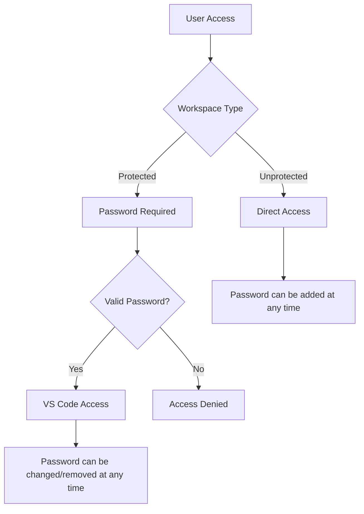

# Security Features

Comprehensive security guide for XaresAICoder platform.

## Table of Contents

- [Security Overview](#security-overview)
- [Workspace Security](#workspace-security)
- [Container Isolation](#container-isolation)
- [Network Security](#network-security)
- [Data Protection](#data-protection)
- [Authentication](#authentication)
- [Best Practices](#best-practices)
- [Security Configuration](#security-configuration)
- [Monitoring](#monitoring)
- [Incident Response](#incident-response)

## Security Overview

XaresAICoder implements a multi-layered security approach focusing on:
- ✅ **Container Isolation** - Each workspace runs in isolated containers
- ✅ **Password Protection & Management** - Workspace-level authentication with set/update/remove support
- ✅ **Network Segmentation** - Isolated Docker networks with dual proxy modes
- ✅ **Resource Limits** - Prevent resource exhaustion attacks
- ✅ **No Root Access** - Non-privileged container execution
- ✅ **Data Isolation** - Separate storage for each workspace
- ✅ **Outgoing Traffic Control** - Security Proxy with domain whitelisting, LLM Logging Proxy for monitoring

### Security Principles

1. **Defense in Depth** - Multiple security layers
2. **Principle of Least Privilege** - Minimal required access
3. **Isolation by Default** - Workspaces cannot access each other
4. **User-Controlled Security** - Optional protection levels
5. **Transparency** - Clear security boundaries and limitations

## Workspace Security

### Password Protection

**Per-Workspace Control**: Security is configurable per workspace rather than platform-wide.

#### Creating Protected Workspaces

```json
{
  "projectName": "secure-project",
  "projectType": "python-flask",
  "passwordProtected": true,
  "password": "MySecurePassword123!"
}
```

#### Password Requirements

- **Minimum Length**: 8 characters
- **Maximum Length**: 50 characters
- **Recommended**: 12+ characters with mixed case, numbers, symbols
- **Auto-Generated**: Secure 12-character passwords available via UI
- **Custom Passwords**: User-defined passwords supported

#### Password Storage

Passwords are persisted to disk via `saveProjectsToDisk()` and survive server restarts:

```javascript
// Passwords are hashed using bcrypt with 10 salt rounds
const bcrypt = require('bcrypt');
const hashedPassword = await bcrypt.hash(password, 10);

// Stored in project metadata (hashed, never plaintext)
project.passwordProtected = true;
project.passwordHash = hashedPassword;
```

**Security Features**:
- ✅ **Bcrypt Hashing** - Industry-standard password hashing with salt
- ✅ **Persistent Storage** - Password state survives server restarts via disk serialization
- ✅ **Container Override File** - Password changes applied to running/stopped containers via `/home/coder/.code-server-auth`
- ✅ **No Plaintext Storage** - Only bcrypt hashes stored server-side

#### Password Management (Set, Update, Remove)

Workspace passwords can be managed after creation via the `PUT /api/projects/:projectId/password` endpoint:

**Set password on unprotected workspace:**
```bash
curl -X PUT http://localhost/api/projects/abc123/password \
  -H "Content-Type: application/json" \
  -d '{"newPassword": "MySecurePassword123!"}'
```

**Update existing password:**
```bash
curl -X PUT http://localhost/api/projects/abc123/password \
  -H "Content-Type: application/json" \
  -d '{"currentPassword": "OldPassword123!", "newPassword": "NewPassword456!"}'
```

**Remove password protection:**
```bash
curl -X PUT http://localhost/api/projects/abc123/password \
  -H "Content-Type: application/json" \
  -d '{"currentPassword": "OldPassword123!", "removePassword": true}'
```

**Implementation details:**
- For **running containers**: writes override file via `docker exec`, then stop+start to apply
- For **stopped containers**: writes override file via `putArchive` API (applied on next start)
- The entrypoint script reads `/home/coder/.code-server-auth` to configure code-server auth mode
- Current password is required when changing or removing protection on already-protected workspaces

#### Protected Operations

Operations requiring password verification:
- **Workspace Access** - VS Code authentication prompt
- **Stop Workspace** - API requires password
- **Delete Workspace** - API requires password
- **Password Change/Remove** - Requires current password

```bash
# Stop protected workspace
curl -X POST http://localhost/api/projects/abc123/stop \
  -H "Content-Type: application/json" \
  -d '{"password": "MySecurePassword123!"}'
```

### Visual Security Indicators

- **Lock Icons** - Protected workspaces show lock symbols in the project list
- **Password Management Modal** - UI for setting, updating, or removing passwords (key icon button)
- **Password Prompts** - Clear authentication requirements for protected operations
- **Status Messages** - Security status in project lists

## Container Isolation

### Docker Security Configuration

```yaml
# Container security settings
services:
  workspace-${PROJECT_ID}:
    security_opt:
      - no-new-privileges:true    # Prevent privilege escalation
    user: "1000:1000"            # Non-root user execution
    read_only: false             # Development needs write access
    tmpfs:
      - /tmp:size=1G,noexec,nosuid,nodev
```

### Resource Limits

```yaml
deploy:
  resources:
    limits:
      cpus: '2.0'               # Maximum CPU cores
      memory: 4G                # Maximum RAM
      pids: 512                 # Maximum processes
    reservations:
      memory: 1G                # Guaranteed RAM
```

**Protection Against**:
- CPU exhaustion attacks
- Memory bombs
- Fork bombs
- Resource starvation

### File System Security

```yaml
volumes:
  # Each workspace has isolated storage
  - workspace_data_${PROJECT_ID}:/home/coder/project
  
tmpfs:
  # Temporary storage with security restrictions
  - /tmp:size=1G,noexec,nosuid,nodev
```

**Features**:
- **Isolated Storage** - Workspaces cannot access each other's files
- **Temporary File Restrictions** - No executable files in /tmp
- **Volume Encryption** - Host-level encryption support
- **Backup Isolation** - Separate backup policies per workspace

### Network Isolation

```yaml
networks:
  xares-aicoder-network:
    driver: bridge
    internal: false              # Internet access allowed
    ipam:
      config:
        - subnet: 172.19.0.0/16  # Isolated subnet
```

**Network Security**:
- **Isolated Subnet** - Separate from host network
- **Service Discovery** - Container name resolution only
- **Port Isolation** - Ports only accessible via proxy
- **No Direct Access** - External access only through nginx

## Network Security

### Outgoing Traffic Control — Dual Proxy Modes

XaresAICoder supports two proxy modes for controlling workspace outgoing traffic:

**Security Proxy (squid)** — Whitelist-only access for student workspaces:
- All traffic must pass through squid proxy with domain whitelist enforcement
- Unauthorized domains return `TCP_DENIED/403`
- Whitelist is dynamically managed via `PUT /api/whitelist` API
- Base domains (apt repos, VS Code extensions) always included

**LLM Logging Proxy (mitmproxy)** — Unrestricted access with recording for teacher workspaces:
- All traffic passes through mitmproxy (no blocking)
- Every accessed domain is recorded per workspace IP
- LLM API conversations are captured in full
- Recorded domains can be reviewed and applied as the Security Proxy whitelist

**Teacher-to-Student Workflow:**
1. Teacher creates workspace with LLM Logging Proxy (unrestricted)
2. Teacher works normally — installs packages, uses AI tools, browses docs
3. All accessed domains are recorded automatically
4. Teacher reviews recorded domains via UI (categorized by type)
5. Teacher applies selected domains as the global squid whitelist
6. Students create workspaces with Security Proxy — only whitelisted domains accessible

See [OUTGOING_PROXY.md](OUTGOING_PROXY.md) for detailed proxy configuration and [LLM_CONVERSATION_LOGGING.md](LLM_CONVERSATION_LOGGING.md) for domain recording details.

### Reverse Proxy Configuration

```nginx
# nginx security headers
add_header X-Frame-Options DENY;
add_header X-Content-Type-Options nosniff;
add_header X-XSS-Protection "1; mode=block";
add_header Referrer-Policy strict-origin-when-cross-origin;

# Workspace access control
location ~* ^/(?<workspace>[a-zA-Z0-9-]+)\.(?<domain>[^/]+)/ {
    # Validate workspace ID format
    if ($workspace !~ ^[a-zA-Z0-9]{12}$) {
        return 403;
    }
    
    proxy_pass http://workspace-$workspace:8080;
    proxy_set_header Host $host;
    proxy_set_header X-Real-IP $remote_addr;
}
```

### Port Security

**Port Allocation**:
- **Dynamic Assignment** - Ports assigned per workspace
- **Range Restrictions** - Only allowed port ranges
- **Proxy-Only Access** - No direct port exposure
- **Automatic Cleanup** - Ports released when workspace stops

```javascript
// Port validation in server
const ALLOWED_PORTS = [3000, 5000, 8000, 8080, 4200, 9000];
const isValidPort = (port) => ALLOWED_PORTS.includes(parseInt(port));
```

### SSL/TLS (Production)

For production deployments with HTTPS:

```nginx
# SSL configuration
ssl_protocols TLSv1.2 TLSv1.3;
ssl_ciphers ECDHE-RSA-AES256-GCM-SHA512:DHE-RSA-AES256-GCM-SHA512;
ssl_prefer_server_ciphers off;
ssl_session_cache shared:SSL:10m;
ssl_session_timeout 10m;

# HSTS header
add_header Strict-Transport-Security "max-age=31536000; includeSubDomains" always;
```

## Data Protection

### Data Classification

| Data Type | Location | Protection Level | Retention |
|-----------|----------|------------------|-----------|
| **Workspace Code** | Container volumes | Isolated | Until deletion |
| **API Keys** | Container environment | User-managed | Session-based |
| **Passwords** | Server disk (hashed) | Bcrypt hashed | Persistent |
| **System Logs** | Host filesystem | Standard | Configurable |
| **Git Repositories** | Forgejo volumes | Git server auth | Persistent |
| **Recorded Domains** | mitmproxy volume | Per-workspace IP | Until container reset |
| **LLM Conversations** | mitmproxy volume | Per-workspace IP | Until container reset |
| **Proxy Logs** | Squid volume | Per-workspace IP | Until container reset |

### Data Isolation

```bash
# Each workspace has separate data volumes
docker volume create workspace_data_abc123
docker volume create workspace_data_def456

# No cross-workspace access possible
docker run --volume workspace_data_abc123:/data workspace-abc123
docker run --volume workspace_data_def456:/data workspace-def456
```

### Backup Security

**Backup Strategy**:
- **Volume-Level Backups** - Isolated per workspace
- **User-Controlled** - Users responsible for their data
- **Git Integration** - Code backed up to Git repositories
- **No Platform Storage** - No persistent user data on platform

### Data Encryption

**At Rest**:
- Host filesystem encryption (user-configured)
- Docker volume encryption support
- Git repository encryption in Forgejo

**In Transit**:
- HTTPS for production deployments
- TLS for internal communication (optional)
- Encrypted Git operations over HTTPS

## Authentication

### Current Authentication Model

XaresAICoder uses **workspace-level authentication** rather than platform-level user accounts:


```mermaid
graph TD
    A[User Access] --> B{Workspace Type}
    B -->|Unprotected| C[Direct Access]
    B -->|Protected| D[Password Required]
    D --> E{Valid Password?}
    E -->|Yes| F[VS Code Access]
    E -->|No| G[Access Denied]
    F --> H[Password can be changed/removed at any time]
    C --> I[Password can be added at any time]
```

### VS Code Authentication

Protected workspaces use VS Code's built-in authentication, controlled by the entrypoint script which reads an optional override file:

```bash
# /home/coder/.code-server-auth (written by password management API)
AUTH_FLAG=password          # or "none" to remove protection
export PASSWORD='secret'    # set when AUTH_FLAG=password
```

### API Authentication

API endpoints respect workspace protection:
- **Stop/Delete** operations require the workspace password in the request body
- **Password management** (`PUT /api/projects/:id/password`) requires current password when changing/removing
- **Adding** a password to an unprotected workspace does not require authentication
- Returns `401 Unauthorized` for invalid passwords

## Best Practices

### For Users

#### 1. Workspace Security
```bash
# Always use strong passwords for sensitive projects
{
  "passwordProtected": true,
  "password": "MyVerySecurePassword123!@#"
}

# Regularly backup important code to Git
git add .
git commit -m "Regular backup"
git push origin main

# Don't store secrets in code
echo "API_KEY=secret" >> .env
echo ".env" >> .gitignore
```

#### 2. API Key Management
```bash
# Store API keys as environment variables, not in code
export OPENAI_API_KEY=your_key_here

# Use different keys for different projects
export PROJECT_A_KEY=key1
export PROJECT_B_KEY=key2

# Monitor API usage regularly
# Check provider dashboards for unusual activity
```

#### 3. Network Security
```bash
# Bind development servers to all interfaces for port forwarding
# Flask
app.run(host='0.0.0.0', port=5000)

# Node.js
app.listen(3000, '0.0.0.0')

# Spring Boot
server.address=0.0.0.0
```

### For Administrators

#### 1. Platform Hardening
```bash
# Regular security updates
apt update && apt upgrade -y

# Monitor Docker security
docker system events

# Regular log review  
docker compose logs | grep -i error
```

#### 2. Resource Monitoring
```bash
# Monitor resource usage
docker stats

# Check for suspicious activity
docker ps -a | grep -E "(restart|exit)"

# Monitor network connections
netstat -tulpn | grep docker
```

#### 3. Backup Strategy
```bash
# Regular platform backups
docker compose down
tar -czf xaresaicoder-backup.tar.gz .

# Database backups (if using external DB)
pg_dump xaresaicoder > backup.sql
```

## Security Configuration

### Environment Variables

```bash
# Security-related environment variables
MAX_WORKSPACES_PER_USER=5          # Resource limits
DOCKER_NETWORK=xares-aicoder-network # Network isolation

# Production security
FORCE_HTTPS=true                    # Redirect HTTP to HTTPS
SECURE_COOKIES=true                 # HTTPS-only cookies
DISABLE_TELEMETRY=true             # No external telemetry
```

### Docker Compose Security

```yaml
# Security-focused docker-compose.yml
version: '3.8'
services:
  server:
    security_opt:
      - no-new-privileges:true
    cap_drop:
      - ALL
    cap_add:
      - NET_ADMIN  # Only if needed
    
  nginx:
    security_opt:
      - no-new-privileges:true
    cap_drop:
      - ALL
    cap_add:
      - CHOWN      # Only if needed
      - DAC_OVERRIDE
```

### Firewall Configuration

```bash
# UFW configuration for production
ufw default deny incoming
ufw default allow outgoing

# Allow SSH
ufw allow ssh

# Allow HTTP/HTTPS
ufw allow 80
ufw allow 443

# Enable firewall
ufw enable
```

## Monitoring

### Security Monitoring

```bash
# Monitor failed authentication attempts
docker compose logs server | grep -i "invalid password"

# Monitor resource usage
docker stats --format "table {{.Container}}\t{{.CPUPerc}}\t{{.MemUsage}}"

# Monitor network connections
ss -tulpn | grep docker
```

### Log Analysis

```bash
# Security-relevant log patterns
grep -E "(failed|error|unauthorized)" /var/log/auth.log

# Docker security events
docker system events --filter type=container --filter event=die

# Application security logs
docker compose logs | grep -E "(401|403|error)"
```

### Automated Monitoring

```bash
#!/bin/bash
# security-monitor.sh

# Check for unusual container activity
CONTAINER_COUNT=$(docker ps -q | wc -l)
if [ $CONTAINER_COUNT -gt 20 ]; then
  echo "Alert: High container count: $CONTAINER_COUNT"
fi

# Check for high resource usage
HIGH_CPU=$(docker stats --no-stream --format "{{.CPUPerc}}" | sed 's/%//' | awk '$1 > 80')
if [ ! -z "$HIGH_CPU" ]; then
  echo "Alert: High CPU usage detected"
fi

# Check for failed authentications
FAILED_AUTH=$(docker compose logs server | grep -c "Invalid password")
if [ $FAILED_AUTH -gt 10 ]; then
  echo "Alert: Multiple authentication failures: $FAILED_AUTH"
fi
```

## Incident Response

### Security Incident Types

1. **Unauthorized Access** - Someone accessing protected workspace
2. **Resource Abuse** - Excessive CPU/memory usage
3. **Container Escape** - Attempt to break container isolation
4. **Data Breach** - Unauthorized access to workspace data
5. **API Abuse** - Excessive API requests or attacks
6. **Proxy Bypass** - Workspace attempting to bypass proxy restrictions
7. **Whitelist Abuse** - Unauthorized whitelist modifications

### Response Procedures

#### 1. Immediate Response
```bash
# Stop all containers
docker compose down

# Review logs
docker compose logs > incident-logs.txt

# Check system integrity
docker system df
docker system info
```

#### 2. Investigation
```bash
# Analyze container activity
docker ps -a --format "table {{.Names}}\t{{.Status}}\t{{.CreatedAt}}"

# Check network connections
netstat -tulpn | grep docker

# Review authentication logs
grep -i "password" docker-compose-logs.txt
```

#### 3. Containment
```bash
# Remove suspicious workspaces
docker rm -f suspicious-container-id

# Reset workspace passwords
# (Requires manual intervention through API)

# Update security configurations
nano .env  # Update security settings
```

#### 4. Recovery
```bash
# Clean system
docker system prune -a

# Rebuild with security updates
./deploy.sh --build-only

# Restore from backups if needed
tar -xzf backup.tar.gz
```

### Reporting

Document security incidents with:
- **Timeline** - When incident occurred
- **Impact** - What was affected
- **Root Cause** - How it happened
- **Response** - Actions taken
- **Prevention** - Future mitigation steps

---

[← Back to AI Tools](AI_TOOLS.md) | [Next: Troubleshooting →](TROUBLESHOOTING.md)